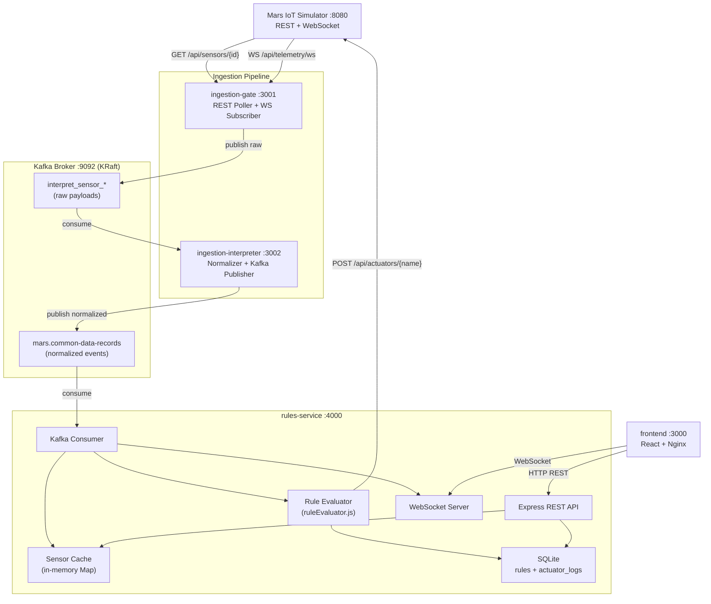
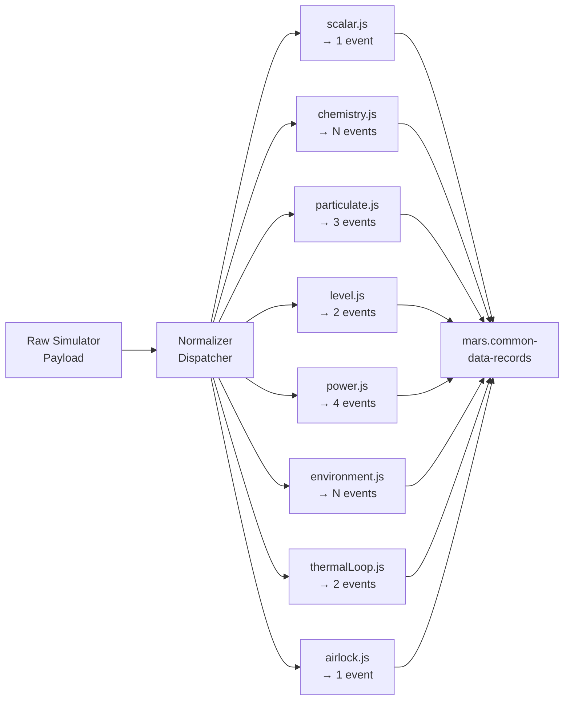
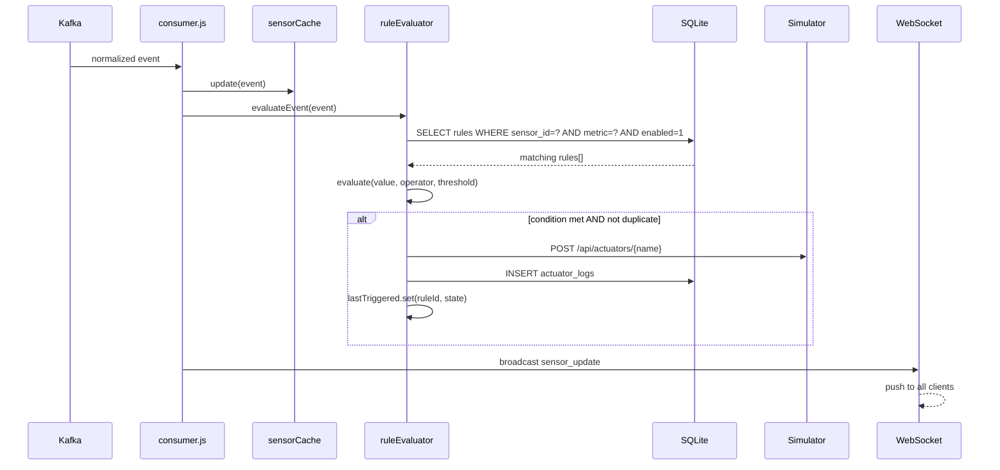

# Architecture Diagrams

## 1. System Architecture

```mermaid
graph TD
    SIM["Mars IoT Simulator :8080\nREST + WebSocket"]

    subgraph "Ingestion Pipeline"
        GATE["ingestion-gate :3001\nREST Poller + WS Subscriber"]
        INTERP["ingestion-interpreter :3002\nNormalizer + Kafka Publisher"]
    end

    subgraph "Kafka Broker :9092 (KRaft)"
        K1["interpret_sensor_*\n(raw payloads)"]
        K2["mars.common-data-records\n(normalized events)"]
    end

    subgraph "rules-service :4000"
        CONSUMER["Kafka Consumer"]
        CACHE["Sensor Cache\n(in-memory Map)"]
        ENGINE["Rule Evaluator\n(ruleEvaluator.js)"]
        DB["SQLite\nrules + actuator_logs"]
        API["Express REST API"]
        WS["WebSocket Server"]
    end

    FRONTEND["frontend :3000\nReact + Nginx"]

    SIM -->|"GET /api/sensors/{id}"| GATE
    SIM -->|"WS /api/telemetry/ws"| GATE
    GATE -->|"publish raw"| K1
    K1 -->|"consume"| INTERP
    INTERP -->|"publish normalized"| K2
    K2 -->|"consume"| CONSUMER
    CONSUMER --> CACHE
    CONSUMER --> ENGINE
    ENGINE -->|"POST /api/actuators/{name}"| SIM
    ENGINE --> DB
    CONSUMER --> WS
    API --> DB
    API --> CACHE
    FRONTEND -->|"HTTP REST"| API
    FRONTEND -->|"WebSocket"| WS
```

## 2. Normalization Flow

```mermaid
graph LR
    RAW["Raw Simulator\nPayload"] --> DISP["Normalizer\nDispatcher"]
    DISP --> S["scalar.js\n→ 1 event"]
    DISP --> C["chemistry.js\n→ N events"]
    DISP --> P["particulate.js\n→ 3 events"]
    DISP --> L["level.js\n→ 2 events"]
    DISP --> PW["power.js\n→ 4 events"]
    DISP --> E["environment.js\n→ N events"]
    DISP --> T["thermalLoop.js\n→ 2 events"]
    DISP --> A["airlock.js\n→ 1 event"]
    S & C & P & L & PW & E & T & A --> KAFKA["mars.common-\ndata-records"]
```

## 3. Rule Evaluation Sequence

```mermaid
sequenceDiagram
    participant K as Kafka
    participant C as consumer.js
    participant SC as sensorCache
    participant RE as ruleEvaluator
    participant DB as SQLite
    participant SIM as Simulator
    participant WS as WebSocket

    K->>C: normalized event
    C->>SC: update(event)
    C->>RE: evaluateEvent(event)
    RE->>DB: SELECT rules WHERE sensor_id=? AND metric=? AND enabled=1
    DB-->>RE: matching rules[]
    RE->>RE: evaluate(value, operator, threshold)
    alt condition met AND not duplicate
        RE->>SIM: POST /api/actuators/{name}
        RE->>DB: INSERT actuator_logs
        RE->>RE: lastTriggered.set(ruleId, state)
    end
    C->>WS: broadcast sensor_update
    WS-->>WS: push to all clients
```
